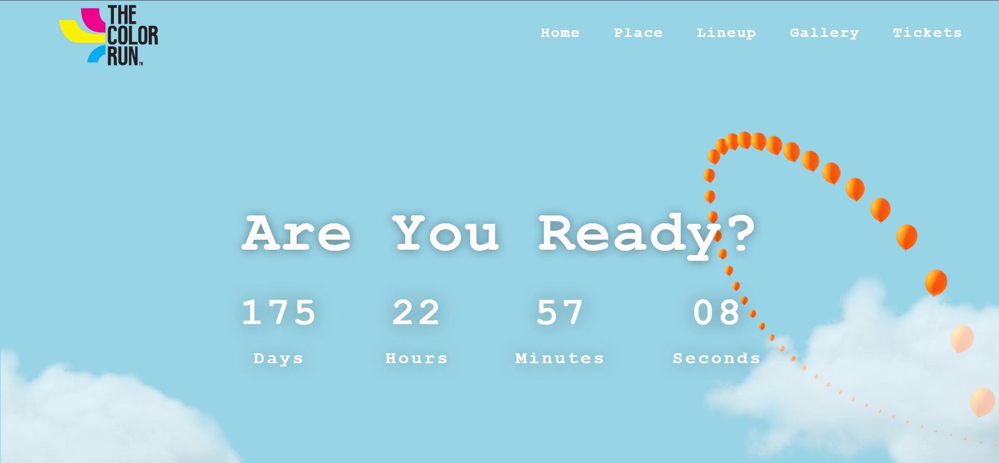
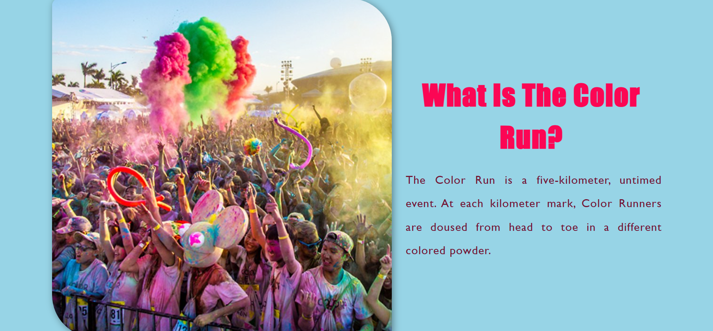
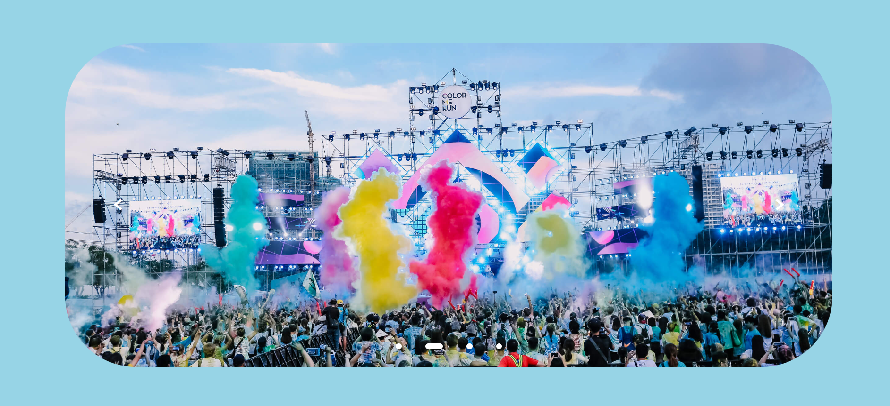
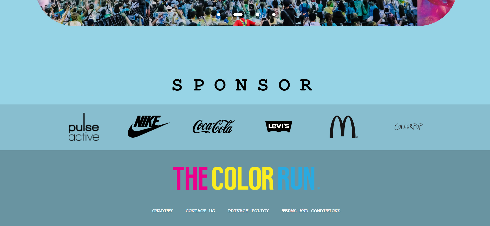
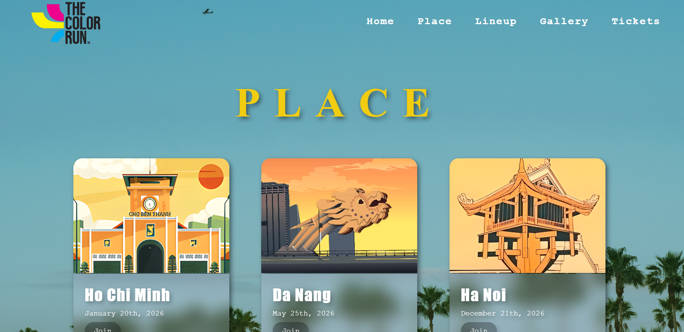
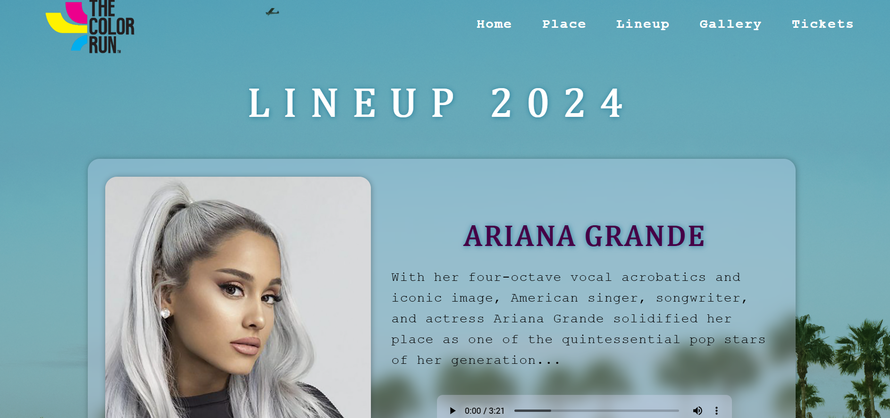
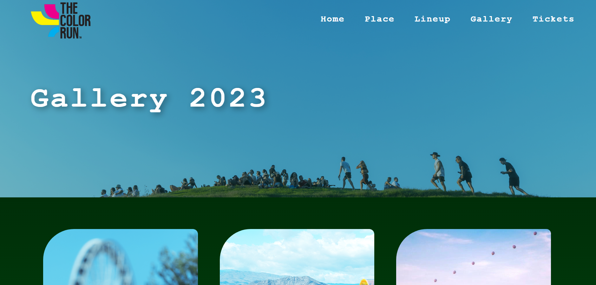
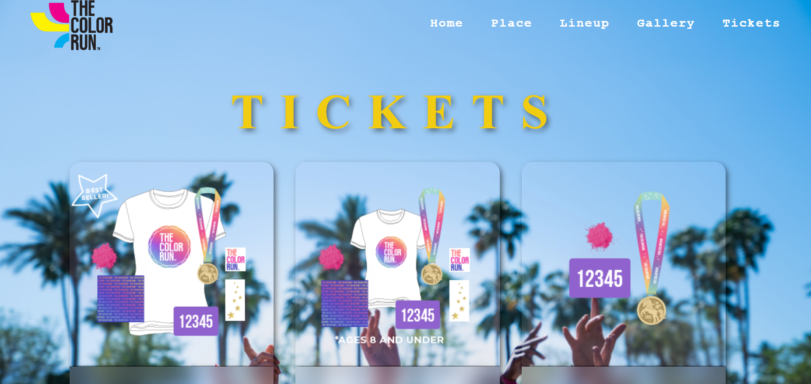

# Festival Website

## [Demo Website](https://chandatt.github.io/festival_web_design/)

## Technologies Used
* React -  A JavaScript library for building user interfaces. Used for creating reusable UI components and managing application state.
* Vite - Provides an extremely fast development server and optimized build process.
## Installation
1. Clone the repository Open your terminal or Git Bash and run:  git clone *`https://github.com/ChanDatt/web-design-festival.git`*
2. Navigate to the directory: *`cd web-design-festival`*
3. Install dependencies: *`npm install`*
4. Start the development server: *`npm run dev`*
## Website Screenshot 
<table>
  <tr>
    <td><em>Home Page</em></td> 
  </tr>
  <tr>
    <td></td>
  </tr>
  <tr>
    <td></td>
  </tr>
  <tr>
    <td></td>
  </tr>
  <tr>
    <td></td>
  </tr>
 </table>
<table>
  <tr>
    <td><em>Place</em></td> 
  </tr>
  <tr>
    <td></td>
  </tr>
 </table>
<table>
  <tr>
    <td><em>Lineup</em></td> 
  </tr>
  <tr>
    <td></td>
  </tr>
 </table>
 
 <table>
  <tr>
    <td><em>Gallery</em></td> 
  </tr>
  <tr>
    <td></td>
  </tr>
 </table>
 <table>
  <tr>
    <td><em>Tickets</em></td> 
  </tr>
  <tr>
    <td></td>
  </tr>
 </table>
